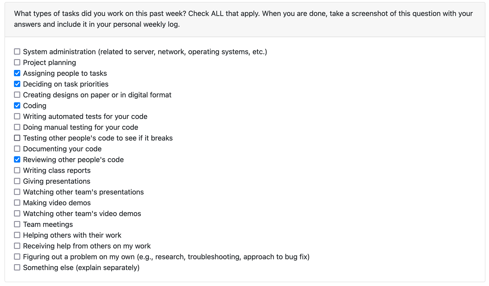

# Personal Log - Satanshu Mishra

**Week**: 4
**Work Period**: `25-09-2023` - `01-10-2023`
**GitHub Account**: `SatanshuMishra`

## Individual Objectives

- Complete Project Plan
  - Proof-read Project Plan
  - Complete `Section 2: Milestones`.
  - Complete `Section 3: Tech Stack`.
- Research Tech Stack
- Create Kanban Board

## Active Tasks

- Complete `Section 2: Milestones`.
- Complete `Section 3: Tech Stack`.
- Research Tech Stack
- Create Kanban Board

## Status of Tasks

- Complete `Section 2: Milestones` - `COMPLETED`.
- Complete `Section 3: Tech Stack` - `COMPLETED`.
- Research Tech Stack - `IN-PROGRESS`.
- Create Kanban Board - `IN-PROGRESS`.

## Peer Review

# Personal Log - Satanshu Mishra

**Week**: 5
**Week**: `02-10-2023` - `08-10-2023`
**GitHub Account**: `SatanshuMishra`

## Individual Objectives

- Learn HTML
- Learn CSS
- Learn JavaScript
- Read Documentation for Next.js
- Design Paper Prototypes (Prototypes Available Locally for Review)
  - Welcome Window (User without Sign-Up)
  - Sign Up Window
  - Sign In Window
- Added Tasks on Kanban Board for Milestone 1

## Active Tasks

- Learn HTML
- Learn CSS
- Learn JavaScript
- Read Documentation for Next.js
- Design Paper Prototypes (Prototypes Available Locally for Review)
  - Welcome Window (User without Sign-Up)
  - Sign Up Window
  - Sign In Window
- Added Tasks on Kanban Board for Milestone 1

## Status of Tasks

- Learn HTML - `COMPLETED`
- Learn CSS - `COMPLETED`
- Learn JavaScript - `COMPLETED`
- Read Documentation for Next.js - `IN-PROGRESS`
- Design Paper Prototypes (Prototypes Available Locally for Review)
  - Welcome Window (User without Sign-Up) - `COMPLETED`
  - Sign Up Window - `COMPLETED`
  - Sign In Window - `COMPLETED`
- Added Tasks on Kanban Board for Milestone 1 - `IN-PROGRESS`

## Peer Review

# Personal Log - Satanshu Mishra

**Week**: 5
**Week**: `02-10-2023` - `08-10-2023`
**GitHub Account**: `SatanshuMishra`

## Individual Objectives

- Setup Development Evironment
  - Install Next.js
  - Install Express.js
  - Install Tailwind CSS
- Setup Docker
  - Setup PostgreSQL Database
  - Setup pgadmin
- Implement User Authentication page
  - Implement Sign-in section
  - Implement Sign-up section

## Active Tasks

- Setup Development Evironment
  - Install Next.js
  - Install Express.js
  - Install Tailwind CSS
- Setup Docker
  - Setup PostgreSQL Database
  - Setup pgadmin
- Implement User Authentication page
  - Implement Sign-in section
  - Implement Sign-up section

## Status of Tasks

- Setup Development Evironment
  - Install Next.js - `COMPLETED`
  - Install Express.js - `COMPLETED`
  - Install Tailwind CSS - `COMPLETED`
- Setup Docker
  - Setup PostgreSQL Database - `COMPLETED`
  - Setup pgadmin - `COMPLETED`
- Implement User Authentication page
  - Implement Sign-in section - `IN-PROGRESS`
  - Implement Sign-up section - `IN-PROGRESS`

## Peer Review

# Personal Log - Satanshu Mishra

**Week**: 8
**Week**:
**GitHub Account**: `SatanshuMishra`

## Individual Objectives

## Active Tasks

## Status of Tasks

## Peer Review

# Personal Log - Satanshu Mishra

**Week**: 9
**Week**: `30/10/2023` - `05/11/2023`
**GitHub Account**: `SatanshuMishra`

## Individual Objectives

- Fix Errors encountered due to merging branching for Mini-Presentations.
  - Fix **JEST Testing** for user authentication pages
    - Sign-In
    - Sign-Up
- Add UI Testing
  - User Authentication
    - Sign-In
    - Sign-Up
- Update designs for the User Authentication Page and Create a Profile Page with consistency, optimization and responsiveness.
  - Improve User Interface Designs
  - Remove Redundant Code
- Develop Chat Page
  - Start designing UI design ideas.

## Active Tasks

- Fix Errors encountered due to merging branching for Mini-Presentations.
  - Fix **JEST Testing** for user authentication pages
    - Sign-In
    - Sign-Up
- Add UI Testing
  - User Authentication
    - Sign-In
    - Sign-Up
- Update designs for the User Authentication Page and Create a Profile Page with consistency, optimization and responsiveness.
  - Improve User Interface Designs
  - Remove Redundant Code
- Develop Chat Page
  - Start designing UI design ideas.

## Status of Tasks

- Fix Errors encountered due to merging branching for Mini-Presentations.
  - Fix **JEST Testing** for user authentication pages
    - Sign-In `IN-PROGRESS`
    - Sign-Up `IN-PROGRESS`
- Add UI Testing
  - User Authentication
    - Sign-In `IN-PROGRESS`
    - Sign-Up `IN-PROGRESS`
- Update designs for the User Authentication Page and Create a Profile Page with consistency, optimization and responsiveness.
  - Improve User Interface Designs `IN-PROGRESS`
  - Remove Redundant Code `IN-PROGRESS`
- Develop Chat Page
  - Start designing UI design ideas. `IN-PROGRESS`

## Peer Review

**Week**: 10
**Week**: `06/11/2023` - `12/11/2023`
**GitHub Account**: `SatanshuMishra`

## Individual Objectives

- Migrate User Auth Back-end to Express.js
  - Sign-Up
  - Sign-In
    - Email
    - Username
- Switch from using Local Storage to Session Data
- Fix Errors encountered due to merging branching for Mini-Presentations.
  - Fix **JEST Testing** for user authentication pages
    - Sign-In
    - Sign-Up
- Add UI Testing
  - User Authentication
    - Sign-In
    - Sign-Up
- Update UI for Nav-Bar to resemble a more modern and minimal aesthetic
- Update designs for the User Authentication Page and Create a Profile Page with consistency, optimization and responsiveness.
  - Improve User Interface Designs
  - Remove Redundant Code
- Develop Chat Page
  - Start designing UI design ideas.

## Active Tasks

- Migrate User Auth Back-end to Express.js
  - Sign-Up
- Switch from using Local Storage to Session Data
- Fix Errors encountered due to merging branching for Mini-Presentations.
  - Fix **JEST Testing** for user authentication pages
    - Sign-Up
- Add UI Testing
  - User Authentication
    - Sign-Up
- Update UI for Nav-Bar to resemble a more modern and minimal aesthetic
- Update designs for the User Authentication Page and Create a Profile Page with consistency, optimization and responsiveness.
  - Improve User Interface Designs
  - Remove Redundant Code
- Develop Chat Page
  - Start designing UI design ideas.

## Status of Tasks

- Migrate User Auth Back-end to Express.js
  - Sign-Up `COMPLETE`
- Switch from using Local Storage to Session Data `IN-COMPLETE`
- Fix Errors encountered due to merging branching for Mini-Presentations.
  - Fix **JEST Testing** for user authentication pages
    - Sign-Up `IN-PROGRESS`
- Add UI Testing
  - User Authentication
    - Sign-Up `IN-PROGRESS`
- Update UI for Nav-Bar to resemble a more modern and minimal aesthetic IN-PROGRESS
- Update designs for the User Authentication Page and Create a Profile Page with consistency, optimization and responsiveness.
  - Improve User Interface Designs `IN-PROGRESS`
  - Remove Redundant Code `IN-PROGRESS`
- Develop Chat Page
  - Start designing UI design ideas. `IN-PROGRESS`

## Peer Review

**Week**: 11 - 12
**Week**: `13/11/2023` - `26/11/2023`
**GitHub Account**: `SatanshuMishra`

## Individual Objectives

- Complete Testing for User Auth Page
  - Sign-Up
  - Sign-In
    - Email
    - Username
- Delete User
- Design Chats Page
  - Chats Bubble (With and Without Attachment)
  - Chats Window
- Implement Chats Page Designs

## Active Tasks

- Complete Testing for User Auth Page
  - Sign-Up
  - Sign-In
    - Email
    - Username
- Delete User
- Design Chats Page
  - Chats Bubble (With and Without Attachment)
  - Chats Window
- Implement Chats Page Designs

## Status of Tasks

- Complete Testing for User Auth Page
  - Sign-Up `COMPLETE`
  - Sign-In
    - Email `COMPLETE`
    - Username `COMPLETE`
- Delete User `COMPLETE`
- Design Chats Page
  - Chats Bubble (With and Without Attachment) `COMPLETE`
  - Chats Window `IN-PROGRESS`
- Implement Chats Page Designs `IN-PROGRESS`

## Figma Designs

## Peer Review

**Week**: 12 - 13
**Week**: `27/11/2023` - `03/12/2023`
**GitHub Account**: `SatanshuMishra`

## Individual Objectives

- Complete Testing for User Auth Page
  - Design Edit Profile Page
  - Implement Edit Profile Page
  - Implement Back-End logic for Create Profile Pahe
  - Design Chats UI
  - Implements Chats UI

## Active Tasks

- Complete Testing for User Auth Page
  - Design Edit Profile Page
  - Implement Edit Profile Page
  - Implement Back-End logic for Create Profile Pahe
  - Design Chats UI
  - Implements Chats UI

## Status of Tasks

    - Design Edit Profile Page `IN-PROGRESS`
    - Implement Edit Profile Page `IN-PROGRESS`
    - Implement Back-End logic for Create Profile Page `IN-PROGRESS`
    - Design Chats UI `IN-PROGRESS`
    - Implements Chats UI `IN-PROGRESS`

## Peer Review

**Week**: 15

**Work Period**: 15 January 2024 - 21 January 2024

## Individual Objectives

- Add directories for Labeler - GitHub Actions.
- Re-design and Implement Chat Bubble Compoment
- Modernize Chats Page to use Grids instead of Flex
- Re-design and Implement Conversation Tab Compoment (Used within chats page)

## Active Tasks

- Add directories for Labeler - GitHub Actions.
- Re-design and Implement Chat Bubble Compoment
- Modernize Chats Page to use Grids instead of Flex
- Re-design and Implement Conversation Tab Compoment (Used within chats page)
 

## Status of Tasks

- Add directories for Labeler - GitHub Actions - `Complete`
- Re-design and Implement Chat Bubble Compoment - `Complete`
- Modernize Chats Page to use Grids instead of Flex - `In-Progress`
- Re-design and Implement Conversation Tab Compoment (Used within chats page) - `In-Progress`

## Peer Review

**Week**: 15

**Work Period**: 21 January 2024 - 28 January 2024

## Individual Objectives

- Continue Designing Chat's Page
  - Updated Conversations Side-Bar
  - Implement Conversations Search Bar
  - Add Responsive Chats window
  - Add Responsive Message Component
- Fix Bugs with NavBar
  - Sign-In and Sign-Out State
  - Responsive Styling

## Active Tasks

 - Continue Designing Chat's Page
  - Updated Conversations Side-Bar
  - Implement Conversations Search Bar
  - Add Responsive Chats window
  - Add Responsive Message Component

## Status of Tasks

- Continue Designing Chat's Page
  - Updated Conversations Side-Bar - `Complete`
  - Implement Conversations Search Bar - `Complete`
  - Add Responsive Chats window - `Complete`
  - Add Responsive Message Component - `Complete`
- Fix Bugs with NavBar
  - Sign-In and Sign-Out State - `In-Progress`
  - Responsive Styling - `In-Progress`

Reasoning for the Aesthetic Redegin of the Chat's Page:
- Previously, the chats page was designed with the intention of showing the functionality of our feature rather than then complete product. This page lacked many critical features such as a responsive design which would work at both a desktop and mobile screen size. The new design takes these and other design factors into consideration and significantly improved the look and feel of the website. This not only provides a better look website but also improve user - website interaction.

## Peer Review

**Week**: 16 - 17

**Work Period**: 28 January 2024 - 11 February 2024

## Individual Objectives

- Standardize designs on User Auth pages (Sign-In, Sign-Up, Create Profile)
- Estabilish robust session handling.
- Estabilish functionality to update Components dynamically on session state change.

## Active Tasks

- Standardize designs on User Auth pages (Sign-In, Sign-Up, Create Profile)
- Estabilish robust session handling.
- Estabilish functionality to update Components dynamically on session state change.

## Status of Tasks

- Standardize designs on User Auth pages (Sign-In, Sign-Up, Create Profile)  - `Complete`
- Estabilish robust session handling  - `Complete`
- Estabilish functionality to update Components dynamically on session state change `In-Progress`

**Estabilishing functionality to update Components Dyamically**:
Please see issues [#150](https://github.com/COSC-499-W2023/year-long-project-team-10/issues/150) & [#158](https://github.com/COSC-499-W2023/year-long-project-team-10/issues/158) for more information and specific tasks. Effective session management has been one of our key goals since the start of this project. So much of the functionality in our website is guided by the user's state, it is important to use it in a manner that allows for optimal and functional session management. Updating component (and page) states based on session data has been one of the many challenges plaguing us for some time now. We wanted implement components that updated dynamically each time session state changed without the need of a Localstorage or cookie variable that may be vaunrable to browser-side manipulation. During the course of my research, I discovered that Next.js's router.push function enabled a behaviour that didn't reset our layout. Furthermore, though web-sockets, it was possible to dynamically update a variable that would control state for components on the client side. So, I created a global web-socket context and placed it in layout where all childern in the website would be able to access it. Then using the functions I defined, I can update the state of a variable which is used by components to manage their state.

## Peer Review

